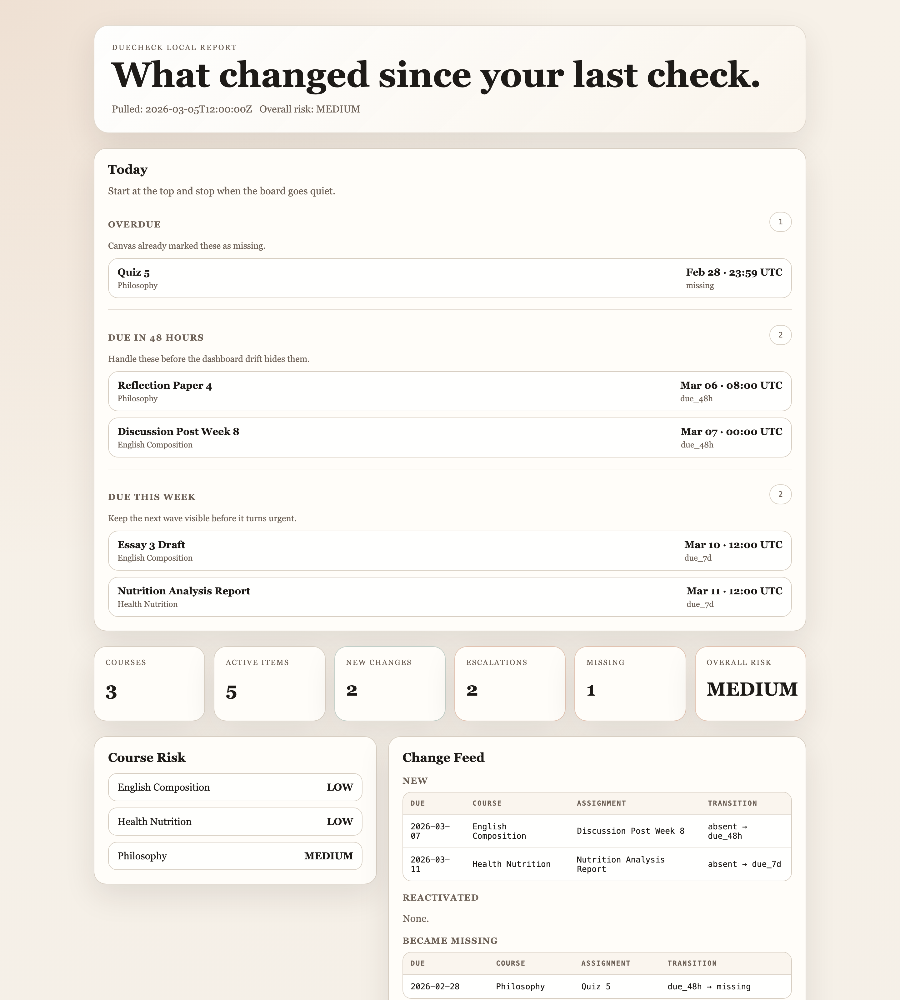
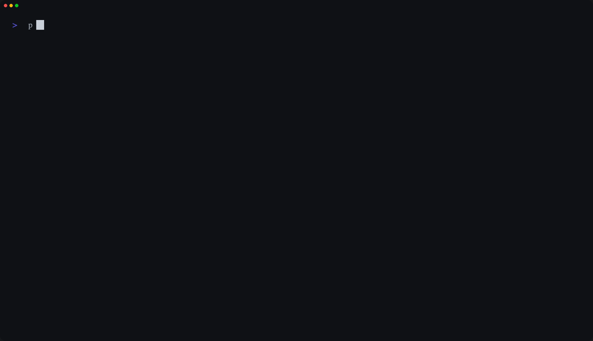

# DueCheck

DueCheck tells you what changed in Canvas since your last check.



- See new deadlines, missing work, and escalations without re-reading every course page.
- Keep a local assignment ledger and compare today against the last good snapshot.
- Generate a static report you can open in a browser with no hosted service and no runtime dependencies.



## Quick Start

### After v0.2.0 is published

```bash
pip install duecheck
duecheck demo --out-dir ./demo --open
```

### From source / development

```bash
git clone https://github.com/cjchanh/duecheck.git
cd duecheck
python3 -m venv .venv
source .venv/bin/activate
pip install -e ".[dev]"
duecheck demo --out-dir ./demo --open
```

## Demo Flow

No Canvas account needed:

```bash
duecheck demo --out-dir ./demo --open
duecheck verify --out-dir ./demo --json
duecheck report --html --out-dir ./demo --open
```

## What It Produces

- `report.html` — self-contained local report with a Today board, change feed, and ledger table
- `ledger.json` — persistent assignment ledger with typed artifact metadata
- `delta.json` — structured diff between the current run and the previous ledger state
- `changes.md` — markdown changelog generated from the delta
- `risk.json` — rule-based academic risk summary
- `runs/` — immutable per-run snapshots used for history and repair

## Example Output

```markdown
# Assignment Changes
_Pulled: 2026-03-05T12:00:00Z_

## Summary
- new: 1
- became_missing: 1
- escalated: 1
- deadline_moved_later: 1
```

## Canvas Quickstart

Get a Canvas API token from: Canvas > Settings > Approved Integrations > New Access Token.

```bash
export CANVAS_TOKEN="your-token-here"
duecheck --canvas-url https://canvas.yourschool.edu --out-dir ./my-classes
```

## First-Time Setup

If you want to run DueCheck more than once without retyping your Canvas URL and output directory, initialize local CLI defaults:

```bash
duecheck init
duecheck doctor
duecheck schedule install
duecheck
```

Config precedence is:

```text
CLI flags > environment variables > config file > hard default
```

If you choose to save a Canvas token with `duecheck init`, it is stored as plaintext on disk in your local config file. DueCheck does not claim to encrypt it.

macOS-first passive scheduling is available through:

```bash
duecheck schedule install
duecheck schedule status
duecheck schedule remove
```

The scheduler installs a LaunchAgent that runs the normal pull flow and refreshes `report.html`. If a token is not already stored in config, the install step may embed the currently resolved token in a private local runner script so the scheduled job does not depend on shell env inheritance.

## Safe Bug Reports

If you hit a real issue, generate a redacted bundle before opening an issue:

```bash
duecheck redact --out-dir ./my-classes --dest ./duecheck-bugreport
duecheck verify --out-dir ./duecheck-bugreport --json
duecheck report --html --out-dir ./duecheck-bugreport
```

The redacted bundle keeps artifact structure, statuses, dates, counts, and change types, but replaces course names, assignment names, source keys, and derived item identities.

## Experimental Extension Shell

The first browser-wrapper move is now in-repo at [`wrappers/chrome-extension/`](wrappers/chrome-extension/).

- MV3 popup shell with live Canvas fetch for upcoming assignments
- extension-side snapshot diffing for upcoming assignments with a `What Changed` feed
- dynamic per-origin host permission request for your Canvas instance
- local popup states for `no-credentials`, `loading`, `empty`, `ready`, `stale-with-error`, and `error-no-data`
- token stored locally in extension storage, not encrypted by DueCheck
- no external JavaScript dependencies

Load it unpacked in Chrome if you want a click-open preview of the wrapper direction. This phase fetches live upcoming assignments and surfaces upcoming-assignment changes only. Missing-work parity, risk scoring, IndexedDB history, and DOM injection are still deferred.

## CLI Reference

```text
duecheck --canvas-url URL --out-dir DIR [options]

Core options:
  --canvas-token TOKEN       Canvas token to use directly for this run
  --token-env VAR           Env var with Canvas token (default: CANVAS_TOKEN)
  --course-filter COURSE    Filter to specific courses
  --grade-threshold N       Risk threshold (default: 80.0)
  --repair                  Rebuild delta from existing ledger
  --fail-on TOKEN           Exit 2 on HIGH|MEDIUM|escalated|missing
  --json                    Output summary as JSON

Extra commands:
  duecheck init [--yes] [--print-path]
  duecheck demo --out-dir DIR [--json] [--open]
  duecheck doctor [--out-dir DIR] [--check-auth] [--json]
  duecheck schedule install [--hour H] [--minute M] [--json]
  duecheck schedule status [--json]
  duecheck schedule remove [--json]
  duecheck redact --out-dir DIR --dest DIR [--json]
  duecheck verify --out-dir DIR [--json]
  duecheck report --html --out-dir DIR [--output PATH] [--json] [--open]
```

## Technical Notes

DueCheck is a stdlib-only Python engine for Canvas assignment tracking. It:

1. Pulls courses, assignments, and missing submissions from Canvas.
2. Builds a typed ledger of assignment state with `schema_version`, `engine_version`, and `source_adapter`.
3. Computes a structured delta with change types like `new`, `became_missing`, `escalated`, `cleared`, and additive deadline movement annotations.
4. Scores academic risk with deterministic rules instead of heuristics or AI.
5. Validates artifacts before writing them, then writes through temp files plus atomic replace.

The CLI UX layer adds:

- `duecheck init` for local config bootstrap at `~/.config/duecheck/config.json`
- `duecheck doctor` for local diagnostics before you file an issue
- `duecheck schedule ...` for macOS-first passive daily sync and report refresh
- `duecheck redact` for safe, reproducible bug-report bundles
- runtime precedence of `CLI > env > config > hard default`
- `wrappers/chrome-extension/` for the experimental MV3 wrapper that fetches live upcoming assignments from Canvas and surfaces upcoming-assignment changes

Backward compatibility is preserved for older artifacts through migration shims:

- legacy `confidence` still loads
- produced artifacts write only `severity_label`
- import paths from `duecheck.__init__` stay stable

## Schemas

Machine-readable schemas ship inside the package at [`duecheck/schemas/`](duecheck/schemas/):

- [`duecheck/schemas/ledger.schema.json`](duecheck/schemas/ledger.schema.json)
- [`duecheck/schemas/delta.schema.json`](duecheck/schemas/delta.schema.json)
- [`duecheck/schemas/risk.schema.json`](duecheck/schemas/risk.schema.json)

`duecheck verify` uses a matching stdlib-only structural validator against the same artifact contract.

## Architecture

```text
duecheck/
  adapter.py        Canvas adapter
  cli.py            CLI entrypoint
  delta.py          Delta computation
  ledger.py         Ledger build and migration
  renderers/        Markdown and HTML rendering
  risk.py           Rule-based risk scoring
  schemas/          Packaged JSON Schemas
  types.py          Shared types and artifact models
  validate.py       Stdlib artifact validation
```

## Development

```bash
pytest -q
ruff check .
python3 -m build
twine check dist/*
```

## Community

- [Contributing](CONTRIBUTING.md)
- [Security Policy](SECURITY.md)
- [Code of Conduct](CODE_OF_CONDUCT.md)

## License

MIT. See [LICENSE](LICENSE).
